# Домашнее задание к занятию "`Система мониторинга Zabbix`" - `Дедюрин Денис`
---

## Задание 1

### 1. Перед установкой zabbix-server выполняем обновление системы.
yum update -y

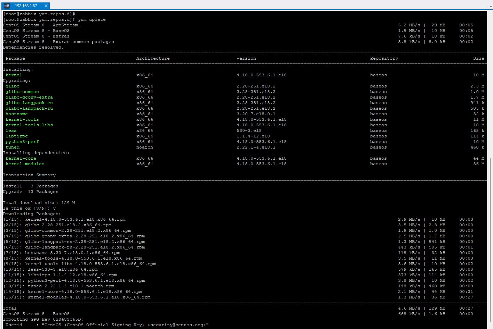

### 2. Устанавливаем PosgreSQL, используя официальную документацию.

#### Install the repository RPM:
sudo dnf install -y https://download.postgresql.org/pub/repos/yum/reporpms/EL-8-x86_64/pgdg-redhat-repo-latest.noarch.rpm

#### Disable the built-in PostgreSQL module:
sudo dnf -qy module disable postgresql


#### Install PostgreSQL:
sudo dnf install -y postgresql14-server

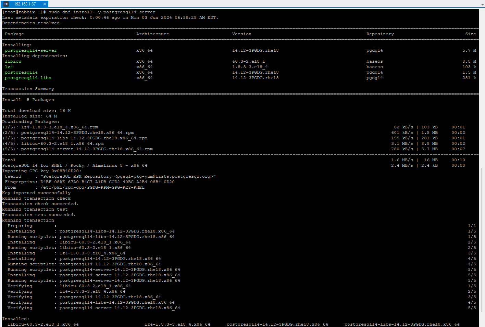

#### Optionally initialize the database and enable automatic start:
sudo /usr/pgsql-14/bin/postgresql-14-setup initdb
sudo systemctl enable postgresql-14
sudo systemctl start postgresql-14

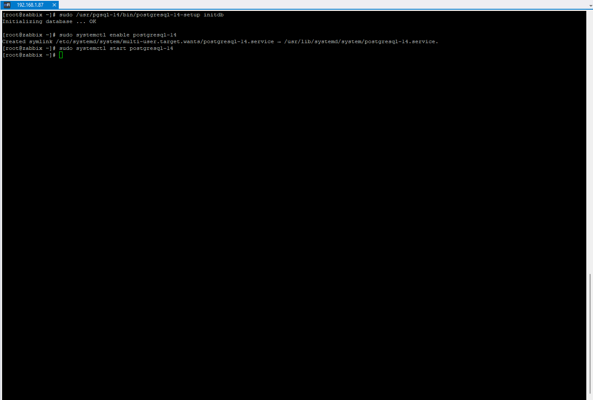

### 3. Устанавливаем репозиторй Zabbix.

rpm -Uvh https://repo.zabbix.com/zabbix/6.0/rhel/8/x86_64/zabbix-release-6.0-4.el8.noarch.rpm
dnf clean all

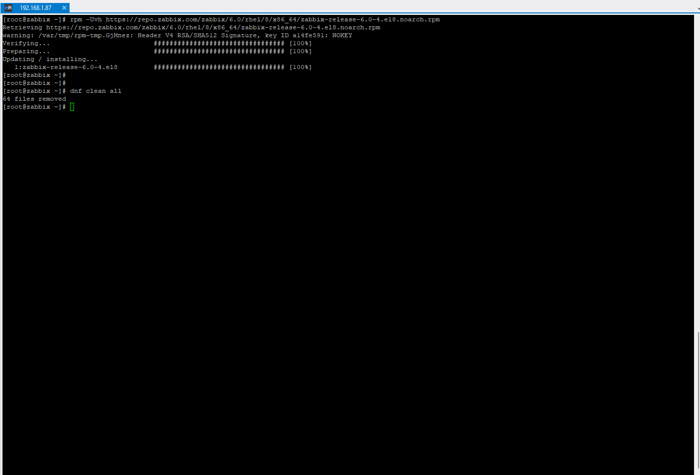

### 4. Устанавливаем Zabbix сервер и веб-интерфейс.
dnf install zabbix-server-pgsql zabbix-web-pgsql zabbix-apache-conf zabbix-sql-scripts zabbix-selinux-policy

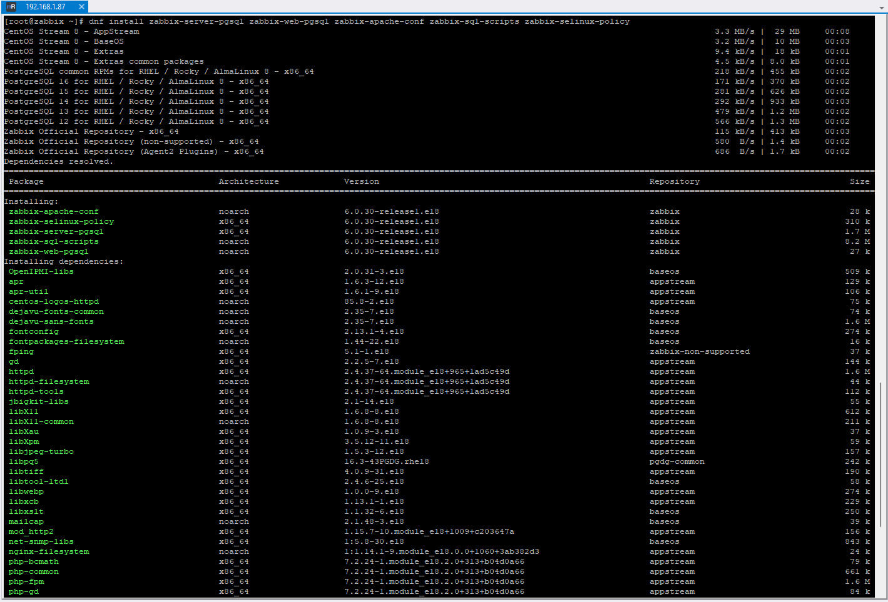

### 5. Создаем БД Zabbix и пользователя.

su - postgres -c "psql --command \"CREATE USER zabbix WITH PASSWORD '123456789';\""

su - postgres -c "psql --command \"CREATE DATABASE zabbix OWNER zabbix;\""

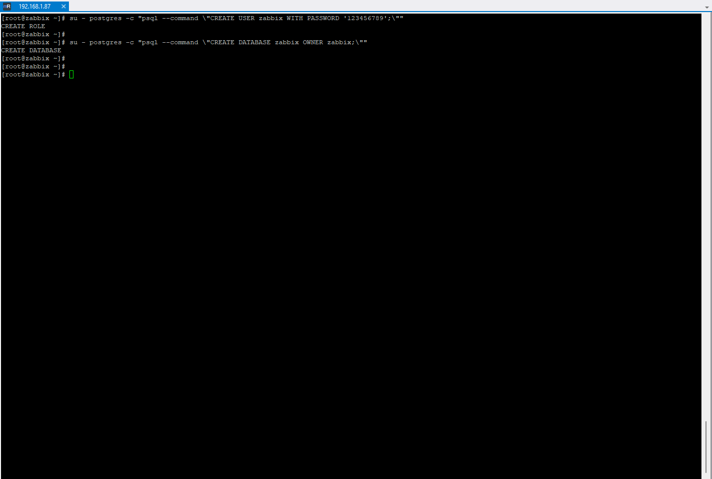

### 6. Импортируем начальную схему и данные.

zcat /usr/share/zabbix-sql-scripts/postgresql/server.sql.gz | sudo -u zabbix psql zabbix

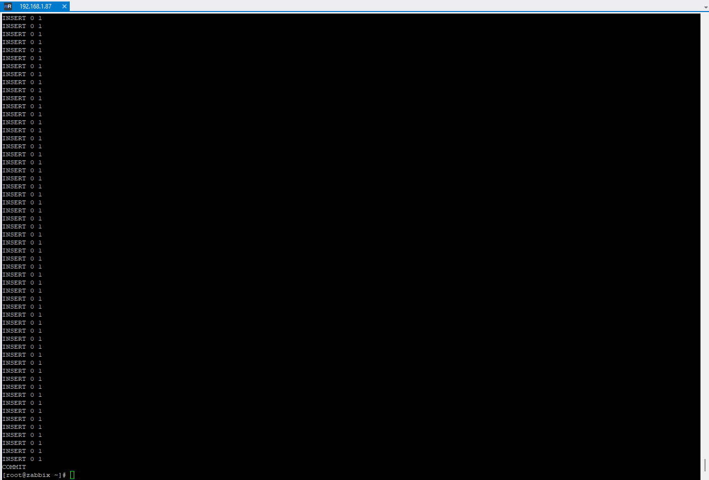

### 7. Редактируем файл: /etc/zabbix/zabbix_server.conf с помощью команды sed

sed -i 's/# DBPassword=/DBPassword=123456789/g' /etc/zabbix/zabbix_server.conf

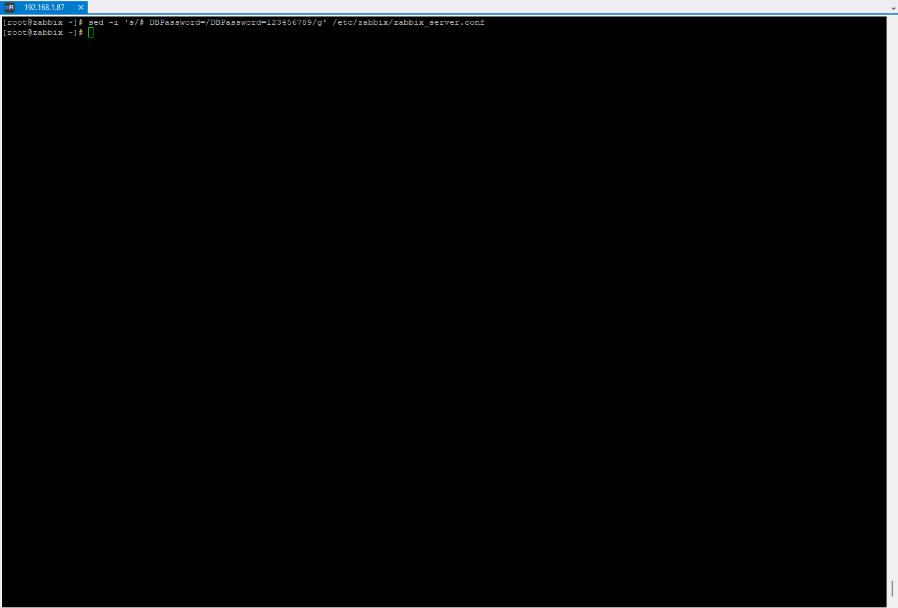

### 8. Запускаем Zabbix-сервер, web-server. Добавляем в автозагрузку.

systemctl restart zabbix-server httpd php-fpm
systemctl enable zabbix-server httpd php-fpm

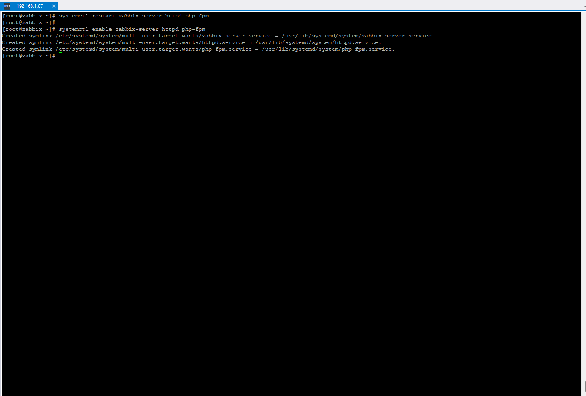

### 9. Заходим в web-интерфейс для первоначальной настройки Zabbix.

Адрес: http://192.168.1.87/zabbix


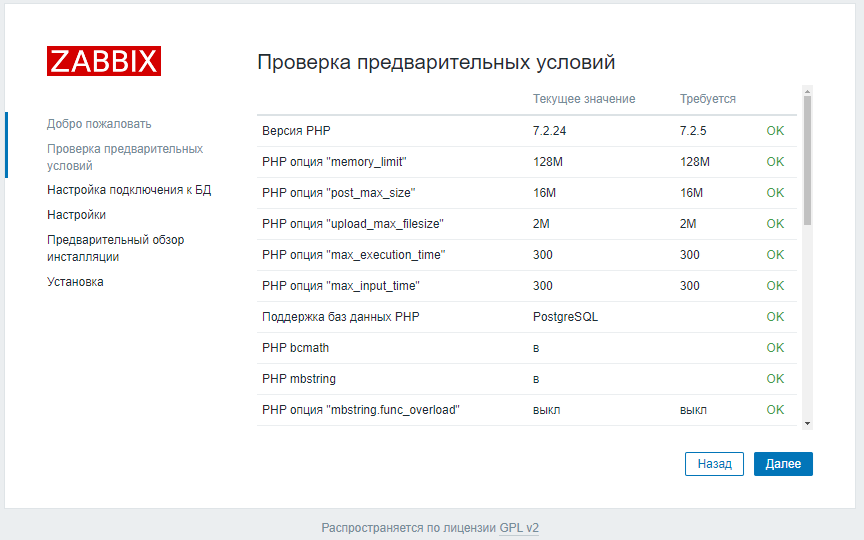
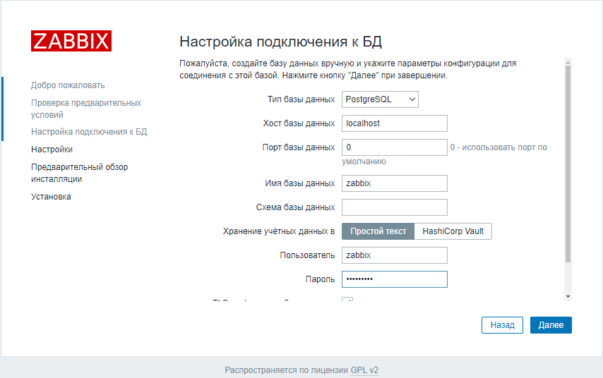
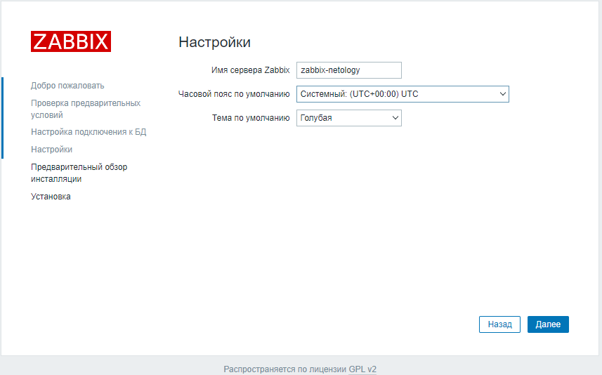
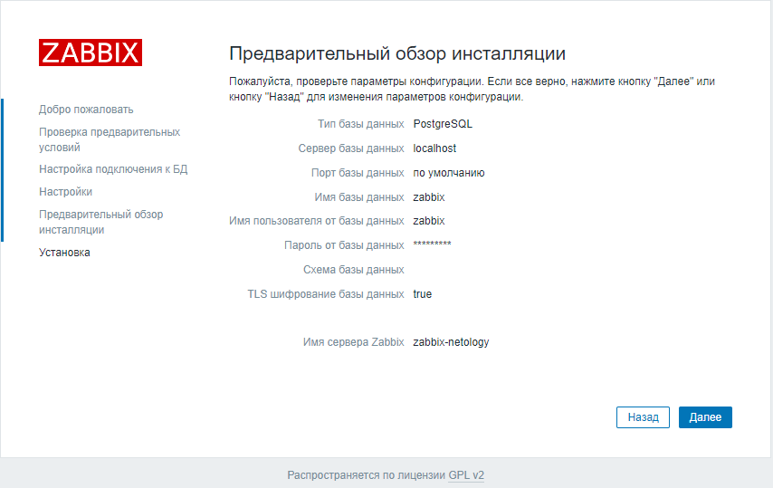
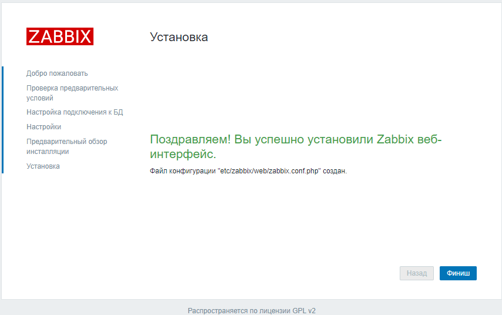
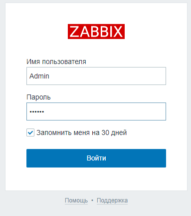
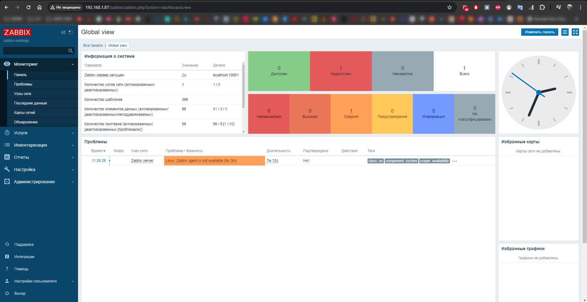

---

## Задание 2

`Приведите ответ в свободной форме........`

1. `Заполните здесь этапы выполнения, если требуется ....`
2. `Заполните здесь этапы выполнения, если требуется ....`
3. `Заполните здесь этапы выполнения, если требуется ....`
4. `Заполните здесь этапы выполнения, если требуется ....`
5. `Заполните здесь этапы выполнения, если требуется ....`
6. 

```
Поле для вставки кода...
....
....
....
....
```

`При необходимости прикрепитe сюда скриншоты
`


---

### Задание 3

`Приведите ответ в свободной форме........`

1. `Заполните здесь этапы выполнения, если требуется ....`
2. `Заполните здесь этапы выполнения, если требуется ....`
3. `Заполните здесь этапы выполнения, если требуется ....`
4. `Заполните здесь этапы выполнения, если требуется ....`
5. `Заполните здесь этапы выполнения, если требуется ....`
6. 

```
Поле для вставки кода...
....
....
....
....
```

`При необходимости прикрепитe сюда скриншоты
`

### Задание 4

`Приведите ответ в свободной форме........`

1. `Заполните здесь этапы выполнения, если требуется ....`
2. `Заполните здесь этапы выполнения, если требуется ....`
3. `Заполните здесь этапы выполнения, если требуется ....`
4. `Заполните здесь этапы выполнения, если требуется ....`
5. `Заполните здесь этапы выполнения, если требуется ....`
6. 

```
Поле для вставки кода...
....
....
....
....
```

`При необходимости прикрепитe сюда скриншоты
`
