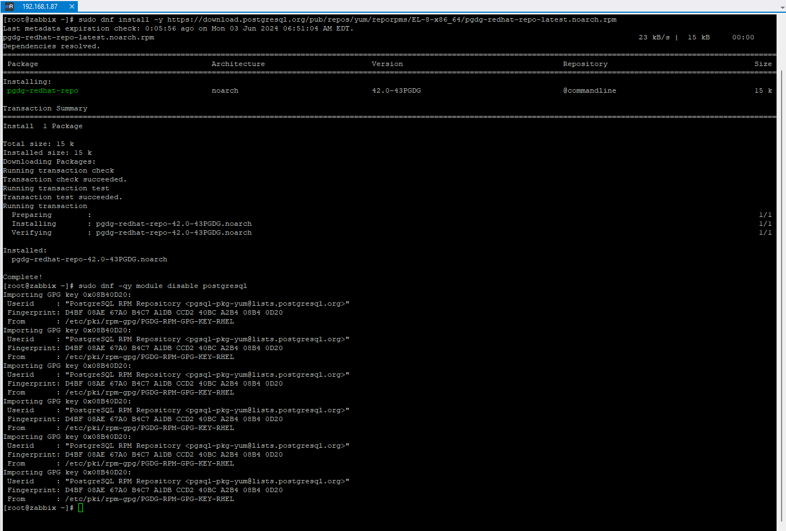
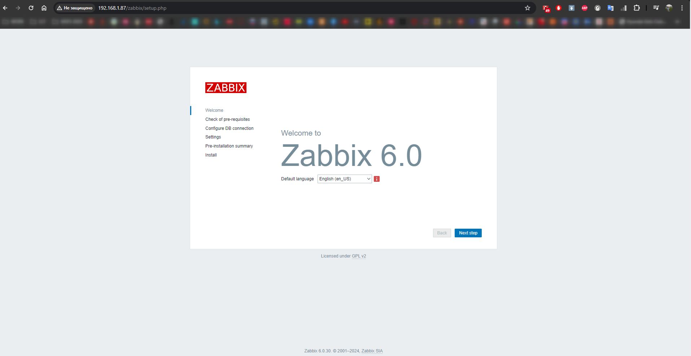
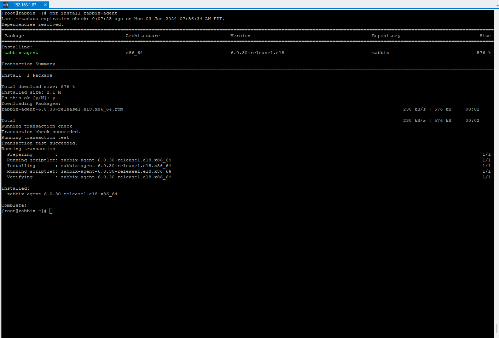
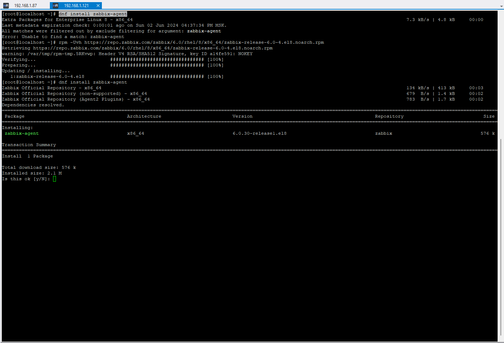
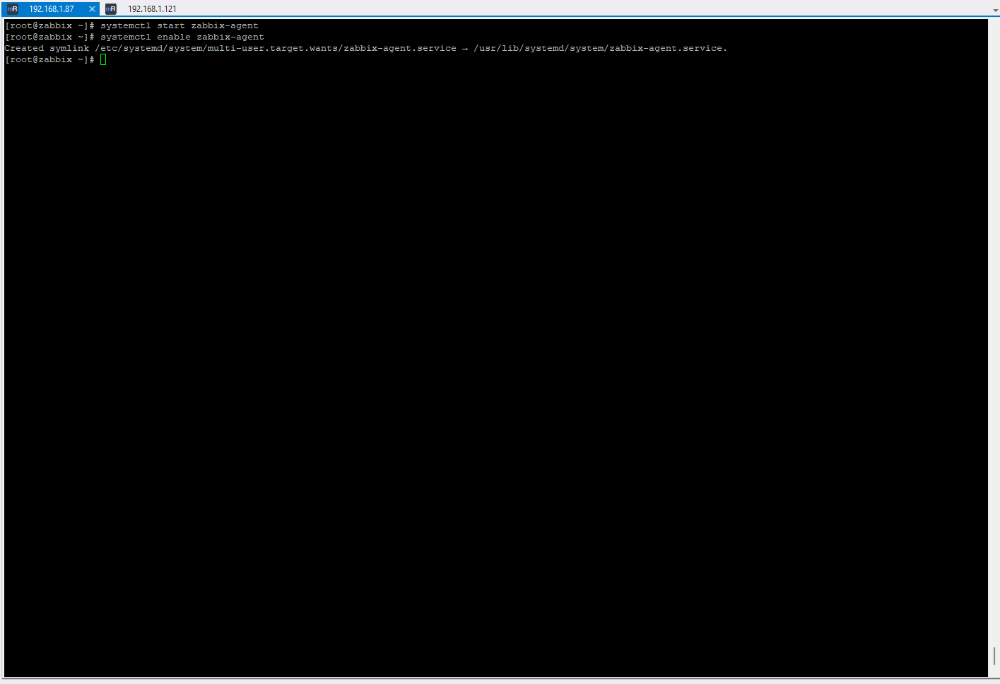
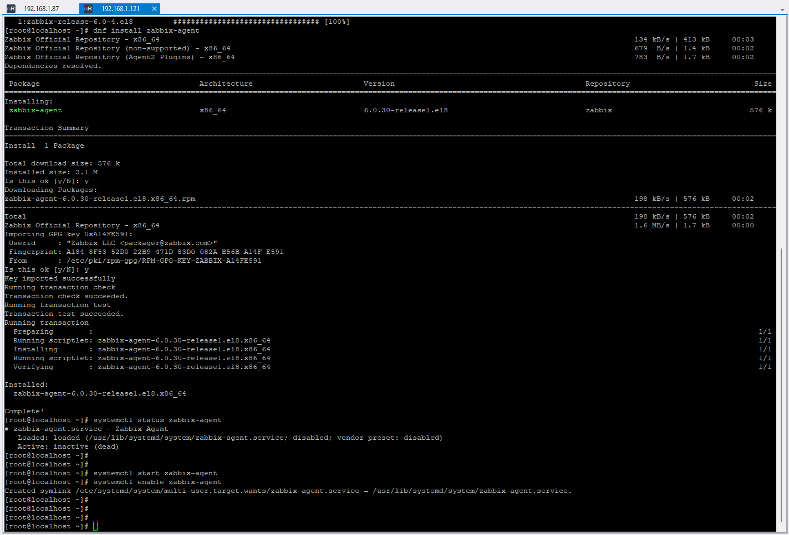
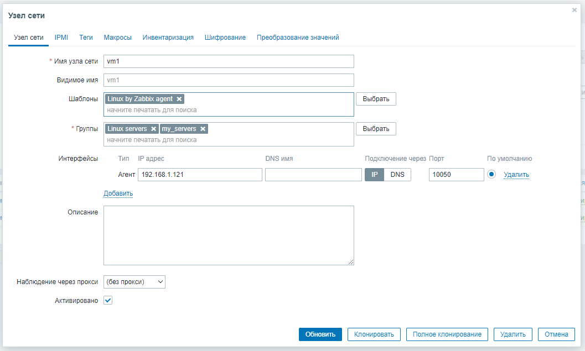
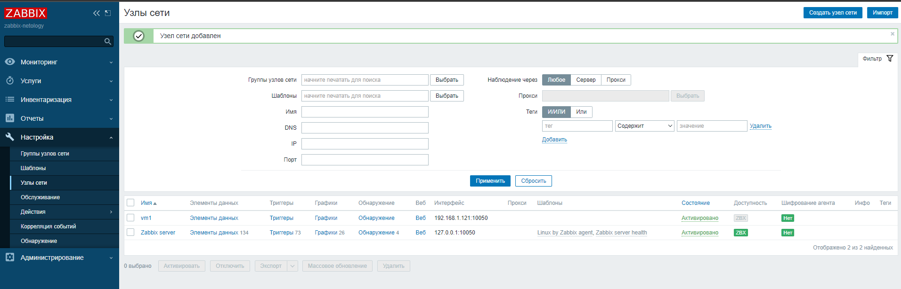
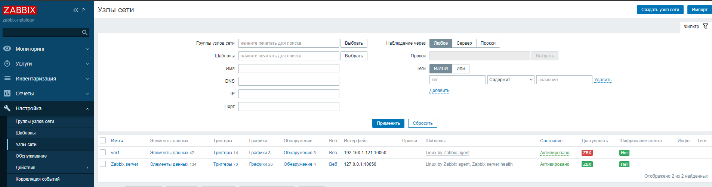
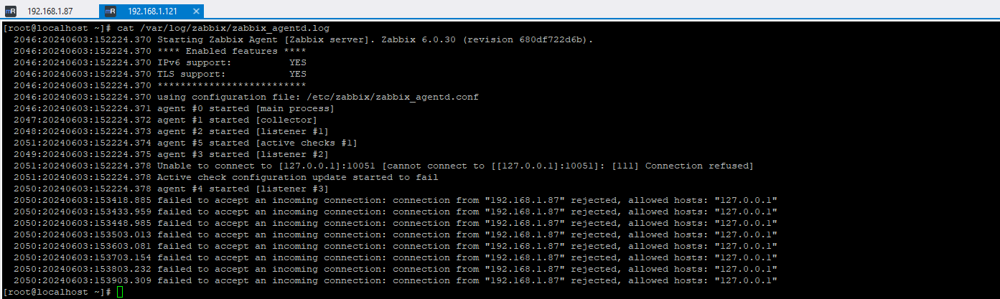

# Домашнее задание к занятию "`Система мониторинга Zabbix`" - `Дедюрин Денис`
---

## Задание 1

### 1. Перед установкой zabbix-server выполняем обновление системы.
```
yum update -y
```


### 2. Устанавливаем PosgreSQL, используя официальную документацию.

#### Устанавливаем репозиторий:
```
sudo dnf install -y https://download.postgresql.org/pub/repos/yum/reporpms/EL-8-x86_64/pgdg-redhat-repo-latest.noarch.rpm
```
#### Disable the built-in PostgreSQL module:
```
sudo dnf -qy module disable postgresql
```


#### Install PostgreSQL:
```
sudo dnf install -y postgresql14-server
```


#### Иницализируем БД и добавляем в автозапуск:
```
sudo /usr/pgsql-14/bin/postgresql-14-setup initdb
sudo systemctl enable postgresql-14
sudo systemctl start postgresql-14
```


### 3. Устанавливаем репозиторй Zabbix.
```
rpm -Uvh https://repo.zabbix.com/zabbix/6.0/rhel/8/x86_64/zabbix-release-6.0-4.el8.noarch.rpm
dnf clean all
```


### 4. Устанавливаем Zabbix сервер и веб-интерфейс.
```
dnf install zabbix-server-pgsql zabbix-web-pgsql zabbix-apache-conf zabbix-sql-scripts zabbix-selinux-policy
```


### 5. Создаем БД Zabbix и пользователя.
```
su - postgres -c "psql --command \"CREATE USER zabbix WITH PASSWORD '123456789';\""
su - postgres -c "psql --command \"CREATE DATABASE zabbix OWNER zabbix;\""
```


### 6. Импортируем начальную схему и данные.
```
zcat /usr/share/zabbix-sql-scripts/postgresql/server.sql.gz | sudo -u zabbix psql zabbix
```


### 7. Редактируем файл: /etc/zabbix/zabbix_server.conf с помощью команды sed
```
sed -i 's/# DBPassword=/DBPassword=123456789/g' /etc/zabbix/zabbix_server.conf
```


### 8. Запускаем Zabbix-сервер, web-server. Добавляем в автозагрузку.
```
systemctl restart zabbix-server httpd php-fpm
systemctl enable zabbix-server httpd php-fpm
```


### 9. Заходим в web-интерфейс для первоначальной настройки Zabbix.

Адрес: http://192.168.1.87/zabbix




---

## Задание 2

### 1. Устанавливаем zabbix-agent на 2-х ВМ. Один агент будет установлен на туже ВМ где и zabbix-server
```
dnf install zabbix-agent
```


```
rpm -Uvh https://repo.zabbix.com/zabbix/6.0/rhel/8/x86_64/zabbix-release-6.0-4.el8.noarch.rpm
dnf install zabbix-agent
```


### 2. Запускаем zabbix-agent на ВМ.
```
systemctl start zabbix-agent
systemctl enable zabbix-agent
```



### 3. Добавляем узел через web-интерфейс.





Видим, что в колнке "Доступность", у добавленного узла появился красный статус "zbx" Это говорит о том, что zabbix-agent доверяет только входящему соединению от zabbix-server, если и агент и сервер установлены на одной машине. В случае, если zabbix-agent находится в другом месте, то в его кофигурационный файл необходимо внести изменения.

Для начала можем заглянуть в лог файл и посмотреть на что ругается агент.
```
cat /var/log/zabbix/zabbix_agentd.log
```


Видим что действительно он не пропускает входящие соединения от удаленного сервера:
```
2050:20240603:153418.885 failed to accept an incoming connection: connection from "192.168.1.87" rejected, allowed hosts: "127.0.0.1"
2050:20240603:153433.959 failed to accept an incoming connection: connection from "192.168.1.87" rejected, allowed hosts: "127.0.0.1"
```


```
Поле для вставки кода...
....
....
....
....
```

`При необходимости прикрепитe сюда скриншоты
`


---

### Задание 3

`Приведите ответ в свободной форме........`

1. `Заполните здесь этапы выполнения, если требуется ....`
2. `Заполните здесь этапы выполнения, если требуется ....`
3. `Заполните здесь этапы выполнения, если требуется ....`
4. `Заполните здесь этапы выполнения, если требуется ....`
5. `Заполните здесь этапы выполнения, если требуется ....`
6. 

```
Поле для вставки кода...
....
....
....
....
```

`При необходимости прикрепитe сюда скриншоты
`

### Задание 4

`Приведите ответ в свободной форме........`

1. `Заполните здесь этапы выполнения, если требуется ....`
2. `Заполните здесь этапы выполнения, если требуется ....`
3. `Заполните здесь этапы выполнения, если требуется ....`
4. `Заполните здесь этапы выполнения, если требуется ....`
5. `Заполните здесь этапы выполнения, если требуется ....`
6. 

```
Поле для вставки кода...
....
....
....
....
```

`При необходимости прикрепитe сюда скриншоты
`
